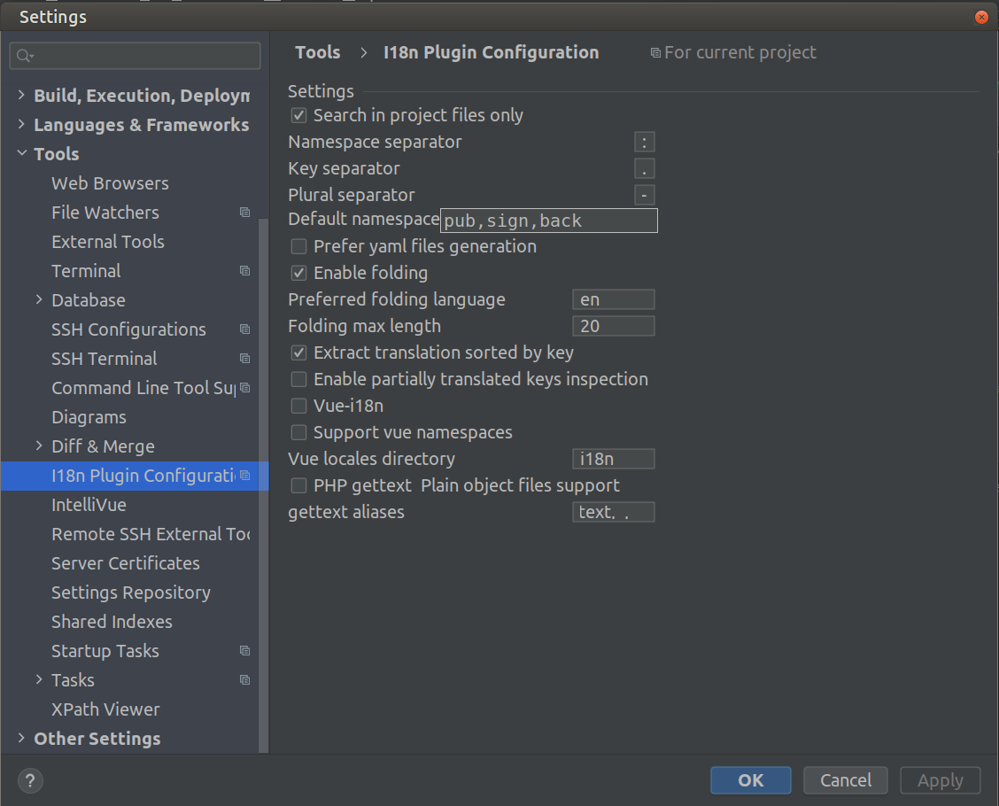

Для использования i18n-плагина для PhpStorm JSON-файлы с переводами нужно размещать примерно в такой структуре:
* /i18n/
  * /en/
    * /namespace.json
    
Структура файла `namespace.json`:

```json
{
  "key": {
    "sub": {
      "value": "use: 'namespace:key.sub.value'"
    }
  }
}
```

При таких настройках плагина:


Плагин начинает работать в коде:
```js
console.log(i18n.t('namespace:key.sub.value'));
```
